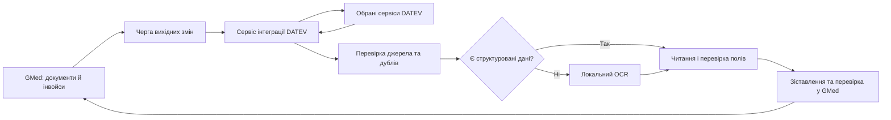

# GMed ↔ DATEV: інвойси та роль OCR

Дата уточнення: 2026-09-05. Користувач підтвердив **DATEV Unternehmen online**
як систему для підключення та цільовий обмін **в обидва боки**.
Перший етап — перегляд без запису в DATEV. Версія Belege online,
доступні API та права бухгалтерії ще не визначені. Підключеного DATEV-конектора
в репозиторії поки немає. Продукт більше не є відкритим питанням;
конкретний API обираємо після перевірки сумісності й прав.

## Рішення

Основний шлях — структуровані реквізити та оригінали документів через
окремий сервіс інтеграції DATEV. На вході спочатку перевіряємо наявність
структурованих даних у відповіді API або в самому електронному інвойсі.
Для ZUGFeRD це може бути XML усередині PDF; XRechnung є структурованим
форматом. Такі поля потрібно читати й перевіряти без OCR.
[Опис форматів DATEV](https://www.datev.de/web/de/berufsgruppenuebergreifend/ueber-datev/portfolio/oekosystem/partnering/datev-marktplatz/faq-zur-datev-e-rechnungsplattform-fuer-softwarehersteller).

Сам факт проходження документа через DATEV не означає, що GMed отримає
повні реквізити, позиції, оригінальний файл або платіжний статус. Це
перевіряється окремо для кожного обраного інтерфейсу та прав доступу.

OCR залишається окремим локальним компонентом для звичайних PDF і сканів.
Наявний `services/invoice-parser` читає UBL/CII XML, XML-вкладення PDF та
виконує OCR і витягування полів через invoice2data. Він не спілкується з DATEV.
Шаблони постачальників не є передумовою запуску інтеграції й не мають
бути єдиним способом обробки довільних документів.

Для PDF/скану невідомого макета додано обмежений розбір явних німецьких
підписів номера, дат і сум; непідтримувані або суперечливі поля порожні.
Це не універсальна модель: результат завжди потребує перевірки. Податковий
режим і статус оплати не визначаються автоматично. Явні відносні платіжні
умови можуть дати пропозицію дати з видимою базою розрахунку та перевіркою.

## Напрями обміну та кандидати DATEV

| Потік | Потрібний результат | Кандидат і межі |
| --- | --- | --- |
| GMed → Unternehmen online: оригінали | Передати затверджений файл інвойсу | Belegbilderservice Rechnungswesen; не обіцяє передачі повної структури рахунку чи зворотного отримання файлів |
| GMed → DATEV: реквізити та документи | Передати затверджений інвойс і пов'язаний оригінал | Rechnungsdatenservice 1.0 передає структуровані дані й документи в Unternehmen online; придатність залежить від версії Belege online |
| GMed → DATEV: бухгалтерські дані | Передати підготовлені проводки та документи | Buchungsdatenservice; облікові правила, рахунки та податкові ключі визначаються з бухгалтерією |
| DATEV → GMed: дані бухгалтерського обліку | Отримати доступні облікові дані й зіставити з інвойсами | Datenservice Export Rechnungswesen; не вважати його універсальним API отримання оригіналів інвойсів |
| Електронні інвойси: отримання та відправлення | Обмін e-invoices через платформу | DATEV E-Rechnungsplattform / TRAFFIQX Invoice API; перевірити фактичний доступ, документацію та тестове середовище |

Джерела: [Rechnungsdatenservice 1.0](https://www.datev.de/web/de/shop/produkt-details/datev-rechnungsdatenservice-1),
[Buchungsdatenservice / accounting:extf-files](https://developer.datev.de/de/product-detail/accounting-extf-files/2.0/overview),
[Export Rechnungswesen](https://www.datev.de/web/de/shop/produkt-details/datev-datenservice-export-rechnungswesen-92913),
[E-Rechnungsplattform](https://www.datev.de/web/de/shop/produkt-details/datev-e-rechnungsplattform-55555).

На дату перевірки DATEV повідомляє, що нова версія Belege online підтримує
Belegbilderservice Rechnungswesen та Buchungsdatenservice, але ще не
Rechnungsdatenservice 1.0. Тому RDS 1.0 не фіксуємо як єдину основу.
Це повторно перевірено після вибору Unternehmen online. DATEV також
вказує можливість перевірки підтримуваних форматів через `duo-version`;
точний маршрут і контракт беремо з документації підключеного API.
[Сумісність нової версії Belege online](https://www.datev.de/web/de/berufsgruppenuebergreifend/service-und-support/umstellungen/auf-neue-version-datev-belege-online/fragen-und-antworten).

Export Rechnungswesen описує, зокрема, фінансові роки, рахунки, пакети,
проводки, обороти/залишки та умови платежів. Наявність цих даних не доводить
доступність статусів конкретних інвойсів або їхніх PDF. Описана публікація
даних при архівуванні облікового набору також не є гарантією синхронізації
в реальному часі. [Опис сервісу](https://www.datev.de/web/de/shop/produkt-details/datev-datenservice-export-rechnungswesen-92913).

## Межі компонентів

Це цільова схема. Наявний OCR-контейнер зберігає внутрішню мережу без
виходу в інтернет; облікові дані DATEV йому не потрібні. Мережевий конектор
та авторизацію розміщуємо окремо. Секрети та оновлення токенів належать
бекенду, а права користувачів GMed перевіряються перед імпортом/експортом.

## Правила синхронізації

- Кожна прив'язка включає контекст клієнта DATEV, тип джерела, зовнішній ID,
  внутрішній ID GMed та версію/хеш документа. Номер інвойсу сам по собі
  не є глобально унікальним ключем.
- Отриманий із DATEV документ не відправляється назад як новий. Зберігаємо
  походження, зв'язок версій і ключ повторного запиту. Повторна доставка
  або повторна спроба не має створювати дубль.
- Вихідні інвойси GMed залишаються під контролем GMed. Зміни з DATEV
  зіставляються з ними; конфлікт реквізитів не вирішується сліпим записом
  останнього отриманого значення.
- Статуси передавання, прийняття, бухгалтерського проведення та оплати
  зберігаються окремо. Успішне завантаження не означає, що інвойс оплачено.
  Платіжні зміни застосовуються лише за перевіреними даними відповідного API.
- Оригінал і структуровані дані зберігаються разом із джерелом. Розбіжність
  XML/API та видимого документа має бути доступна для перевірки.
- Суми передаються десятковими значеннями, валюта — окремим полем.
  Перевіряємо загальні суми, податки, позиції, кредит-ноти та часткові оплати
  за підтримуваним контрактом, не виводимо відсутні значення з припущень.
- Прив'язка до пацієнта, замовлення й постачальника виконується у GMed;
  зовнішні номери не трактуються як внутрішні ідентифікатори.

## Перший етап: перегляд без запису в DATEV

Користувач уточнив початковий режим: мати змогу переглядати дані,
не вносити їх у DATEV. Це обмежує перший етап; двосторонній обмін
залишається подальшою ціллю. Нижче — вимоги до майбутнього конектора,
а не опис уже підключеного сервісу.

- У GMed показувати стан підключення, доступний контекст компанії DATEV
  та час останнього успішного отримання даних. Кожен екран має явно
  розрізняти демонстраційні, sandbox-дані та реальні дані DATEV.
- Початковий конектор дозволяє тільки отримання доступних даних.
  Створення, оновлення, видалення документів/проводок і відправлення
  інвойсів у DATEV мають бути заблоковані на сервері; вихідну чергу
  не запускаємо. Прихованої кнопки в інтерфейсі недостатньо.
- Запитувати мінімальні доступні права читання обраного API. Технічні
  запити авторизації та оновлення токенів не є записом бухгалтерських
  даних; дозволені операції перевіряти за контрактом конкретного API,
  а не лише за HTTP-методом.
- Зіставлення з пацієнтом/замовленням і локальні виправлення зберігати
  у GMed лише після дії користувача; у цьому режимі вони не передаються
  назад у DATEV. Перегляд сам по собі не створює інвойс у GMed.
- Наявність облікових даних, наприклад проводок і залишків, не означає
  наявності оригіналів інвойсів або їхнього статусу оплати. Відображати
  тільки фактично доступні поля та файли.

Без доступу DATEV можна підготувати локальну демонстрацію на синтетичних
даних. Для реального тестування API потрібні організація та застосунок
у DATEV Developer Portal, Client ID/Client Secret і підписка на обраний
API-продукт. DATEV зазвичай надає sandbox для онлайн-API, якщо документація
не визначає виняток. Sandbox не є доступом до даних бухгалтерії.
[Порядок підключення і sandbox](https://developer.datev.de/en/product-detail/accounting-dataexchange/1/documentation).

Для перегляду реальних даних додатково потрібні активований сервіс,
права бухгалтерії та допуск застосунку до робочого API згідно з вимогами
DATEV. Export Rechnungswesen є кандидатом для облікових даних; джерело
PDF/XML інвойсів визначається окремо після уточнення продукту бухгалтерії.
[Умови отримання облікових даних](https://www.datev.de/web/de/shop/produkt-details/datev-datenservice-export-rechnungswesen-92913).

### Реалізований інтерфейс перегляду DATEV

На `/invoices` додано перемикання між рахунками GMed та `source=datev`.
DATEV за замовчуванням показує чесний стан «Не підключено», без реальних
даних, успішної авторизації чи вигаданої синхронізації. `datev_mode=demo`
відкриває три синтетичні рахунки з PDF, пошуком, фільтрами й переглядом
у центрованій модалці. У демо використовуються виключно вигадані клієнти
та замовлення. Підтверджені прив'язки зберігаються в пам'яті сторінки;
реальні інвойси або зв'язки у БД не створюються.

Підключення винесено на окрему сторінку `/admin/datev` з пунктом
«Підключення DATEV» у меню «Адміністрування». Попередню картку в загальних
налаштуваннях і модалку підключення в інвойсах прибрано. Доступ відповідає
правам розділу адміністрування; з рахунків адміністратор переходить на цю
сторінку, інші користувачі продовжують переглядати рахунки й демо.
Unternehmen online відмічено як обрану систему; версія
Belege online та доступи лишаються наступними кроками. Реальний вхід
недоступний до налаштування API та прав.
Модуль демо не виконує запитів до DATEV і не має операцій відправлення.
Браузерні тести перевіряють цей факт, підбір клієнта, скидання замовлення
після зміни клієнта, ручну прив'язку, завантаження PDF і мобільне центрування.

## Наступні кроки

### Модулі бухгалтерії та профіль підготовки — 05.09.2026

Користувач підтвердив Belege online, Belegfreigabe online, Bank online,
Kassenbuch online, Auswertungspakete Rechnungswesen online та
Liquiditätsmonitor online. У `/admin/datev` усі шість модулів обрані
за замовчуванням; адміністратор може змінити перелік, указати назву
компанії, Beraternummer / Mandantennummer та відому версію Belege online.
Номери — контекст компанії DATEV, а не ідентифікатори пацієнтів GMed.

`GET/PUT /api/v1/admin/datev/setup` зберігає профіль у
`datev_integration_setup` (міграція `20260905210000`). Доступ обмежено
точними ролями CEO / IT Admin; поточне меню адміністрації доступне CEO.
Версія запису захищає від перезапису зі старої вкладки (409).
Профіль не містить токенів, секретів або наданих дозволів. Зазначення
«Export Rechnungswesen замовлено» є заявою бухгалтерії, не перевіркою API.
Ці маршрути не виконують вихідних запитів DATEV, авторизації чи записів
бухгалтерських даних. Збереження не змінює `not_configured`.

Додано перехід на офіційну сторінку входу Unternehmen online та
завантаження німецького TXT-списку для бухгалтерії із збереженим профілем.
Вхід у кабінет сам по собі не авторизує GMed.

Перевірені межі: `accounting:clients` + `accounting:dataexchange` —
кандидати для отримання облікових даних із Rechnungswesen, зокрема
проводок та оборотно-сальдових даних. Це не підтверджує доступ до
PDF/XML оригіналів, статусів Belegfreigabe, Bank online, Kassenbuch,
готових PDF-пакетів чи прогнозів Liquiditätsmonitor. Для кожного
потрібно погодити підтримуваний інтерфейс і фактичні права.

Джерела, перевірені 05.09.2026:
- [Експорт облікових даних та API-продукти](https://developer.datev.de/en/use-cases/details/lz85bfgyb2m809rvuie5yuq3).
- [Документація dataexchange: категорії даних та умови підключення](https://developer.datev.de/en/product-detail/accounting-dataexchange/1/documentation).
- [Офіційна сторінка входу Unternehmen online](https://www.datev.de/web/de/berufsgruppenuebergreifend/mydatev/cloud-anwendungen/datev-unternehmen-online).
- [Призначення модулів Unternehmen online](https://www.datev.de/web/de/steuerberatung/loesungen/rechnungswesen/belege-und-daten-digital-in-die-kanzlei-uebertragen/digital-zusammenarbeiten).

### Реалізовано: ручна перевірка вхідного інвойсу

На сторінці інвойсів додано імпорт PDF/PNG/JPEG та XML UBL/CII: оригінал ліворуч,
розпізнані реквізити з можливістю редагування праворуч. У цій самій модалці
обираються клієнт і його замовлення; зміна клієнта скидає замовлення та
підтвердження перевірки. Після підтвердження створюється зовнішній інвойс
і прив'язка до його оригіналу `source_document_id`. Відмова OCR не блокує
ручне заповнення PDF/зображення. XML потребує успішної серверної перевірки
самого оригіналу. Позиції документа наразі показуються для звірки;
зберігаються реквізити, загальні суми й оригінал.

2026-09-05 схему міграції `20260905153000_external_invoice_source_document.sql`
застосовано транзакційно до PostgreSQL на `console-dev.gmed-health.com`.
Збережено schema-only backup у
`/home/gmed/deploy/invoice-import-20260905/schema-before.sql`.
На синтетичних записах перевірено коректну прив'язку, заборону чужого
клієнта, дубля, переприв'язки, зміни на медичний документ і видалення
оригіналу. Перевірочну транзакцію відкочено; health DEV повернув `ok`.

Це попереднє застосування схеми: запис у `_sqlx_migrations` навмисно не
додавався, оскільки чинний DEV-бекенд ще не містить цю embedded-міграцію
і SQLx відхиляє невідомі версії під час старту. Міграція допускає повторне
виконання; новий бекенд виконає і зареєструє її під час наступного деплою.
Нові API імпорту й окремий invoice-parser у межах попереднього кроку
ще не були опубліковані (подальший DEV-деплой описано нижче).
TypeScript, цільовий ESLint, 3 unit-тести сум і 3 браузерні
сценарії перевірено локально. Rust API integration-тест додано; локально
він пропускається без PostgreSQL/Docker, тому не рахується як виконана перевірка.

### DATEV і універсальне розпізнавання

Структурований імпорт уже читає окремий XML і XML-вкладення PDF, показує
розбіжності XML/видимого PDF, отримувача, позиції, податкові підсумки,
передоплату та залишок до сплати. Повна сума інвойсу не замінюється залишком.
Кредит-ноти й інші типи, крім 380, поки лише для перегляду. Це базові
перевірки полів і сум, без XSD/Schematron та сертифікації XRechnung/PDF-A.
Оригінал XML зберігається як binary download після повторної перевірки
сервером; у модалці показується екранованим текстом. Зовнішній обмін DATEV
залишається окремим наступним етапом.

1. Для підтвердженого Unternehmen online з'ясувати версію Belege online
   та права бухгалтерії; окремо підтвердити отримання інвойсів/оригіналів
   і даних оплат. Export Rechnungswesen не вважати автоматично доступним
   лише через наявність Unternehmen online.
2. Отримати специфікації та тестовий доступ потрібних API. Скласти точну
   мапу доступних полів, напрямів, форматів і підтверджень обробки.
3. Підготувати єдину модель інвойсу та адаптери структурованого імпорту/
   експорту. API-повідомлення і XML перевіряти за відповідними схемами.
4. Реалізувати збереження зовнішніх прив'язок, черги, повтори, аудит і захист
   від циклів. Перевірити двосторонній обмін на одному тестовому клієнті DATEV.
5. Виміряти, яка частина потоку лишається PDF/сканами без реквізитів.
   Лише для цієї частини вибирати витягування без шаблонів; invoice2data
   може залишитися додатковим адаптером для відомих макетів.

Старий backlog описував DATEV-експорт. Підтверджений користувачем поточний
scope ширший: обмін в обидва боки. Наявність робочого OCR API не означає
готовності DATEV-інтеграції; підключення й зовнішні тести ще не виконані.

## DEV-білд і перевірка 2026-09-05

За запитом користувача зібрано й активовано на `console-dev.gmed-health.com`:

- `gmed-invoice-backend:20260905`: поточний серверний код із вибірковими
  змінами API OCR, завантаження оригіналу та прив'язки `source_document_id`.
  Сторонні незавершені зміни бекенду зі спільного checkout не включалися.
- `gmed-invoice-parser:20260905`: окремий CPU OCR і розбір німецьких підписів.
- `gmed-invoice-frontend:20260905`: поточний знімок інтерфейсу з DATEV-демо
  та перевіркою вхідного інвойсу. DEV-пароль не передавався у білд.

Усі три контейнери healthy; публічний `/health` повернув `ok`. Parser працює
без опублікованого порту на внутрішній Docker-мережі. Випадковий службовий
ключ створено на DEV у `release.env`; браузер його не отримує. Наступний
повний DEV-деплой також збирає invoice-parser та зберігає це підключення.

Поточні образи й override: `/home/gmed/deploy/invoice-preview-20260905/images.yml`.
Попередні образи, конфігурацію та frontend збережено в `backup/` того ж
каталогу. Поточний вузький білд бекенду використовує попередній набір
embedded-міграцій: схему джерела інвойсу вже було застосовано вручну;
реєстрація міграції лишається за наступним повним деплоєм.

Перевірено 43 Python-тести сервісу, 12 unit-тестів інвойсів/зіставлення,
10 браузерних сценаріїв, TypeScript та цільовий ESLint. Чотири PDF,
надані користувачем, перевірено локально й через авторизований DEV API:
усі відповіді HTTP 200, усі поля збіглися з локальними результатами.
Один документ потребував OCR; решта мали нативний текст. Скан також
перевірено у фактично опублікованій модалці через браузер.
Неавторизований запит OCR повернув 401. Реальні інвойси під час перевірки
не зберігалися; приватні PDF не потрапили в репозиторій або статичні assets.

Обмеження: Reverse Charge і відсутні податкові суми потребують ручної
перевірки; дата банківського списання не підставляється як строк оплати.
Іменний контакт під назвою компанії не зіставляється автоматично з
пацієнтом. Збереження вхідного інвойсу наразі вимагає клієнта та його
замовлення; окремий сценарій витрат компанії без пацієнта не реалізовано.
Реальної авторизації та обміну з DATEV ще немає.

### Допрацювання імпорту після перевірки реальних файлів

Додано `invoice_parser/details.py`: явна фраза про виставлення рахунку без
ПДВ, відносні платіжні умови з видимою базою розрахунку, окрема дата
Lastschrift, позиції з кількістю/ціною, багаторядкові описи та знижки на
кількох сторінках. Податкові проводки DATEV не визначаються. Цитата
документа й метод заповнення доступні через `field_sources`.

Повторна перевірка чотирьох оригіналів: Threema — 1 позиція, нетто
24,45 / ПДВ 0 / підсумок 24,45, запропоновано 15.05.2023 від дати рахунку
+30 днів; KBM — 3 позиції, 655 / 124,45 / 779,45; CLICKDOC — 1 позиція,
29 / 5,51 / 34,51; Telekom — 4 позиції включно зі знижкою, 78,50 /
14,92 / 93,42, дата списання 29.06.2026 окремо від незаданого строку оплати.

Модалка відрізняє успішне розпізнавання від неповного тексту, називає
конкретні незаповнені поля, пояснює походження розрахованих значень,
показує платіжні умови та сторінку кожної позиції. Натискання номера
сторінки відкриває її в оригіналі. Перевірка й прив'язка лишаються обов'язковими.
53 тести Python та 9 сценаріїв імпорту в браузері пройшли локально.

Оновлення DEV збирається на попередньому перевіреному знімку з чотирма
цільовими файлами; поточні незавершені зміни чату з локального checkout
не включаються. Образ parser: `20260905-import2`, frontend після виправлення
переходу між сторінками PDF: `20260905-import3`. Резервна
копія попереднього стану — `import-improvement/backup` у каталозі деплою.

Чотири оригінали пройшли перевірку через DEV API і опубліковану модалку:
усі реквізити, кількість позицій, суми, платіжні дати й джерела значень
перевірено. У скані Tesseract на Windows/Linux відрізняє регістр «Ihrer/ ihrer»,
у нативному тексті PDF інколи відрізняються пробіли; фінансові значення
збіглися точно. Білд із TypeScript-перевіркою на DEV завершився успішно.
Під час цих перевірок інвойси в базу не зберігалися.

### XML-імпорт і DEV-перевірка

Активовано backend/parser `20260905-xml`, frontend `20260905-xml2`.
Усі три сервіси healthy; `/health` повертає `ok`. Окремих міграцій для XML
не потрібно. Знімок і резервні копії розміщено в
`/home/gmed/deploy/invoice-preview-20260905/structured`.
Незалежний сценарій витрат компанії зі спільного локального checkout
у цей DEV-знімок не включено; локальні зміни збережені.

77 Python-тестів і 17 unit-тестів UI/зіставлення/перегляду пройшли.
13 сценаріїв імпорту також пройшли на опублікованому frontend зі
синтетичними API-відповідями; реальні записи у цих тестах не створювались.
UBL/CII з офіційних синтетичних прикладів KoSIT перевірено у контейнері
без мережі та через DEV API. Гібридні тестові PDF перевіряють перевагу XML,
відсутність OCR і показ розбіжності 336,90 в XML проти 999,00 у видимому PDF.
Пошкоджений/активний XML, зовнішні сутності, перевищення 5 МіБ та спроби
завантажити кредит-ноту як звичайний інвойс відхиляються. Валідний XML
проходить повторну перевірку перед перевіркою контексту; тест використав
неіснуюче замовлення, тож документа не створено.

Опубліковані desktop/mobile екрани перевірено з реальними відповідями API;
XML показується текстом, PDF — оригіналом. На телефоні виправлено накладання
перегляду на поля. Усі чотири надані PDF повторно пройшли API/UI-перевірку:
номери, дати й суми не змінилися. Додатково читається явний період послуг KBM
«Mai 2026» і CLICKDOC «01.06.2026 - 30.06.2026»; продовження назви CLICKDOC
«/J» перевірено на оригіналі. Реальні інвойси під час тестів не зберігалися.
Збережений XML перед переглядом перетворюється на безпечний текст за MIME
та розширенням оригіналу; скачування не змінює початкові байти.

Підключення DATEV Unternehmen online все ще потребує доступу до API та
підтвердження версії Belege online. Цей крок працює з локально завантаженими
файлами й не виконує обмін із DATEV.

Перевірки цього етапу: 2 unit-тести серверної валідації, 2 unit-тести
профілю/німецького списку, 5 браузерних сценаріїв, TypeScript і цільовий
ESLint пройшли. Окремий PostgreSQL API-тест перевірив реальну міграцію,
рольовий доступ, ідентифікатори з початковими нулями, збереження,
відхилення додаткових полів і конфлікти ревізій. Тест використовує
ізольовану схему нової функції: повне розгортання чистої бази наразі
падає в давнішій міграції `20260819113000` (Quote line does not exist
or has invalid quantity), до змін DATEV. Тимчасовий PostgreSQL контейнер
та SSH-тунель після перевірки зупинено.

Користувач уточнив: поки доступний лише кабінет бухгалтерії;
застосунок GMed у DATEV Developer Portal ще не зареєстрований.

DEV-деплой цього етапу завершено 05.09.2026: backend і frontend
`gmed-invoice-*:20260905-datev-modules`; invoice-parser лишився `20260905-xml`.
Деплой зібрано на основі попередніх опублікованих джерел із точковим
додаванням DATEV, без паралельних змін інших задач. Міграція
`20260905210000` виконана і зареєстрована SQLx. Резервні копії та
журнали: `/home/gmed/deploy/invoice-preview-20260905/datev-modules/`.
Перша активація автоматично відкотила образи після помилки CRLF у списку
файлів; після виправлення сценарію повторна активація успішна. Порожня
таблиця першої спроби перевірена під блокуванням і відтворена; жодного
профілю користувача на той момент не було.

На опублікованому DEV перевірено 401 без авторизації, 422 для невідомого
модуля, 409 для застарілого запису, збереження підтверджених шести модулів,
повторне завантаження, німецький TXT та desktop/mobile. Тестових номерів
компанії у DEV не записували. Помилок JavaScript, звернень до DATEV,
створення інвойсів чи бухгалтерських операцій не зафіксовано.
