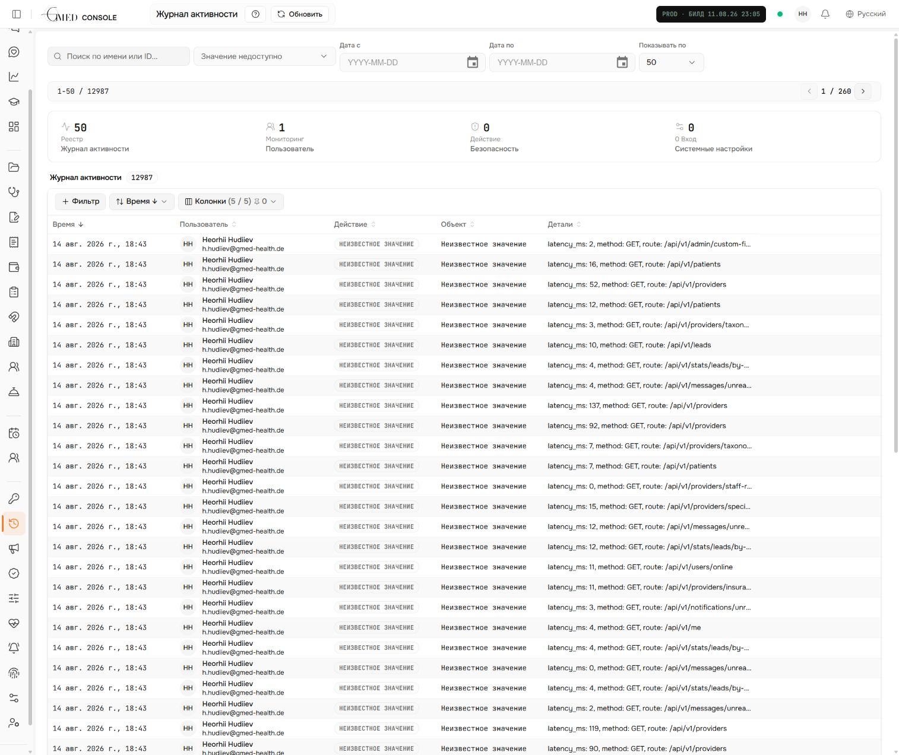
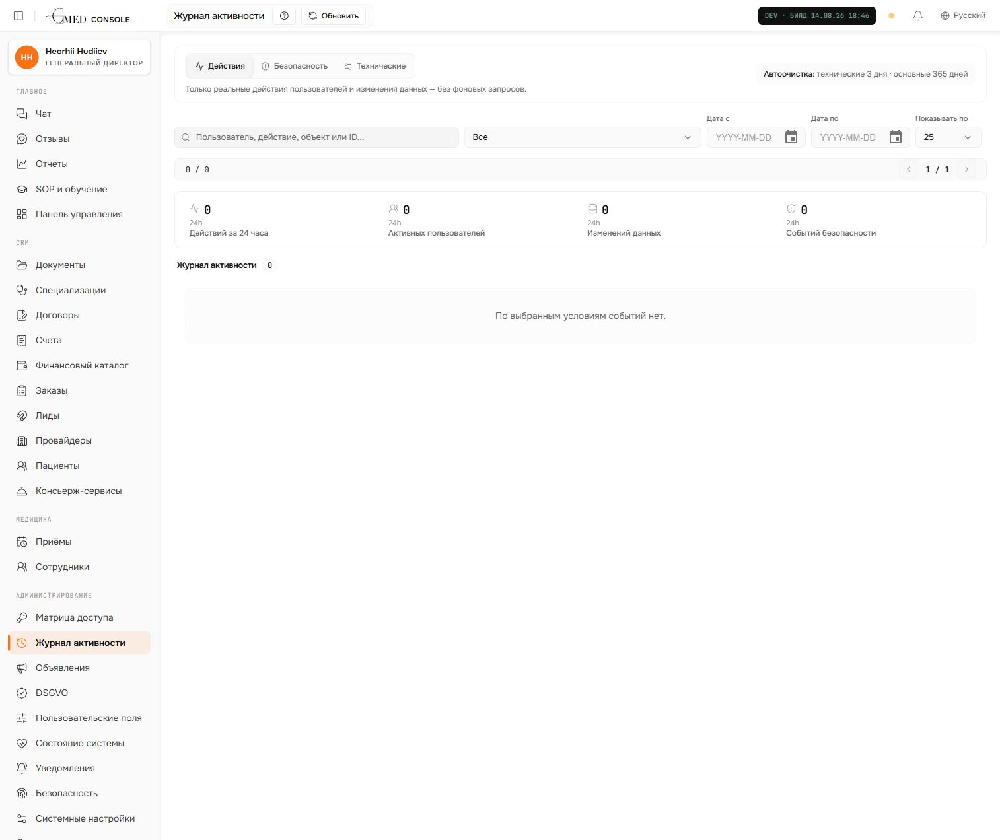

# Activity log audit and redesign

## Scope

The `/admin/activity` screen was reviewed as an IT-admin workflow for answering: who changed what, when, and whether the event needs attention.

## Step 1 — Current production screen

Health: **Poor signal-to-noise**.

- The table structure, filters, pagination, and row details are a useful base.
- Successful background `GET` requests dominate the first page and are rendered as “Unknown value”.
- The four metrics summarize only the loaded page, so values such as 50 total / 1 user do not describe the actual audit trail.
- Search is client-side and therefore cannot find events outside the current page.
- A retention setting exists, but no scheduled audit-log cleanup was running.

## Step 2 — Redesigned local screen

Health: **Clear and task-focused**.

- The default **Activity** stream excludes raw HTTP noise.
- **Security** and **Technical** streams keep specialist data available without mixing it into normal work.
- Search is executed by the API across the complete filtered result set.
- Metrics describe the last 24 hours rather than the current page.
- The active two-tier retention policy is visible: short retention for raw technical requests, long retention for meaningful and security events.
- Routine successful polling endpoints are no longer persisted; failures, mutations, sensitive reads, and annotated domain events remain audited.

## Accessibility notes

- Stream controls expose pressed state and visible focus styling.
- Labels remain visible for date and page-size controls.
- The table keeps semantic headers and keyboard-focusable row behavior from the existing data-table component.
- Screenshot review cannot prove screen-reader announcements or complete keyboard order; those require an interactive assistive-technology pass.

## Retention behavior

- Raw `http_request` events: 3 days by default.
- Meaningful domain and security events: 365 days by default.
- Cleanup runs at server startup and once every 24 hours.
- The database remains immutable outside the explicitly marked retention transaction.
