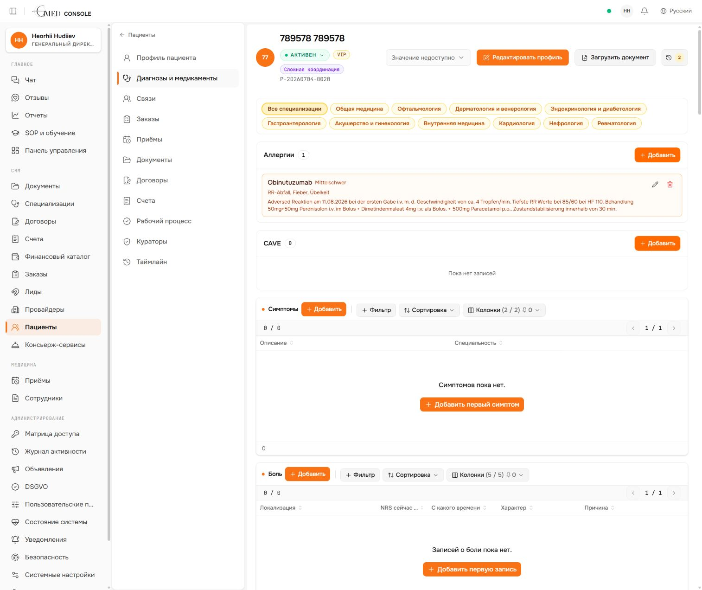
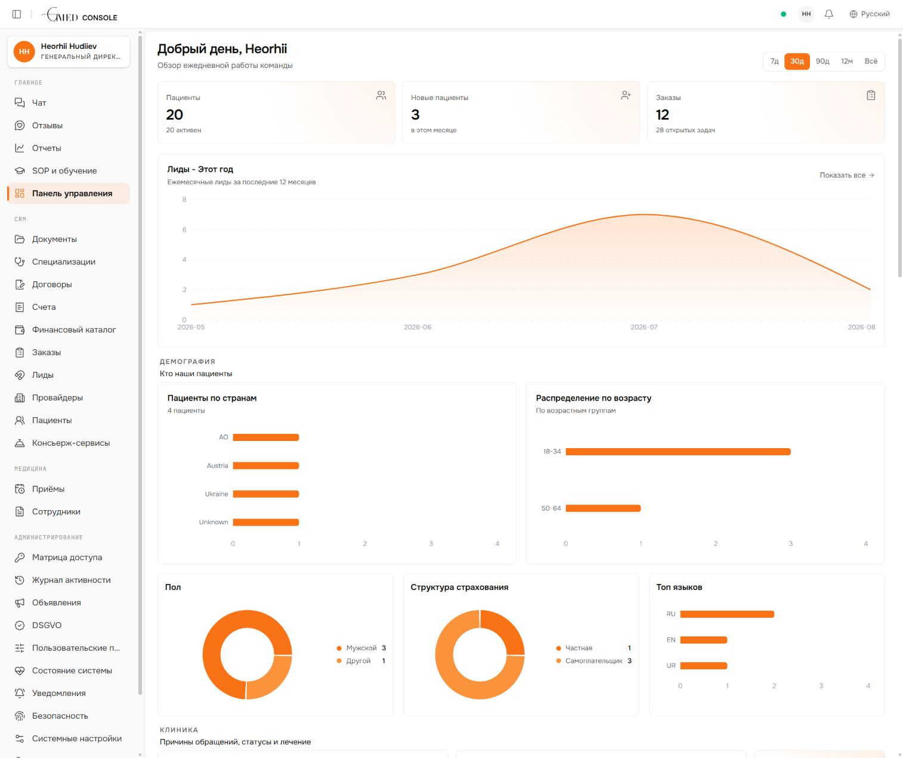
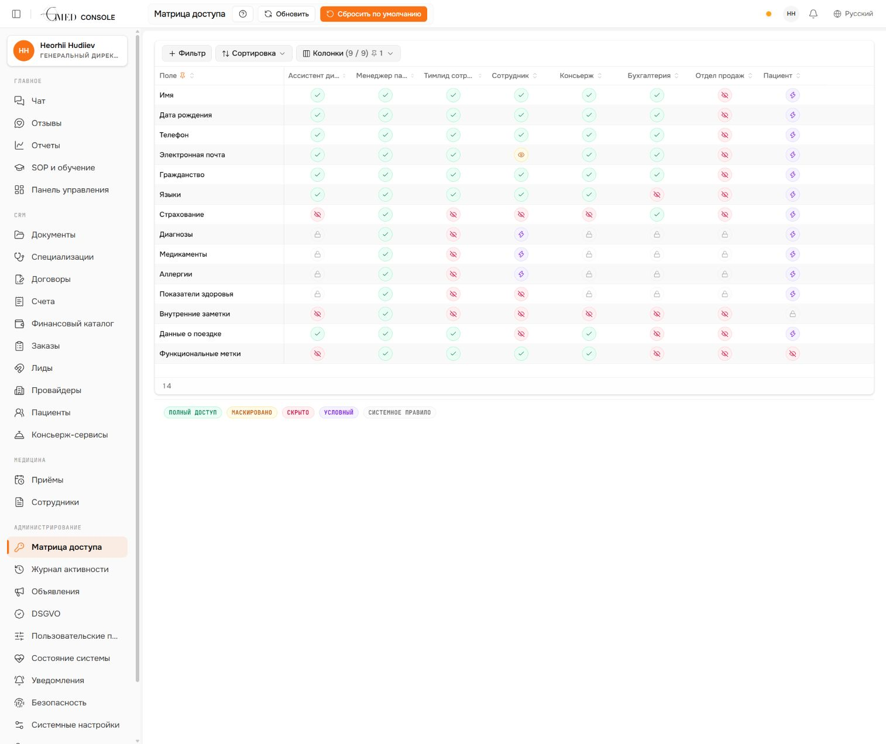
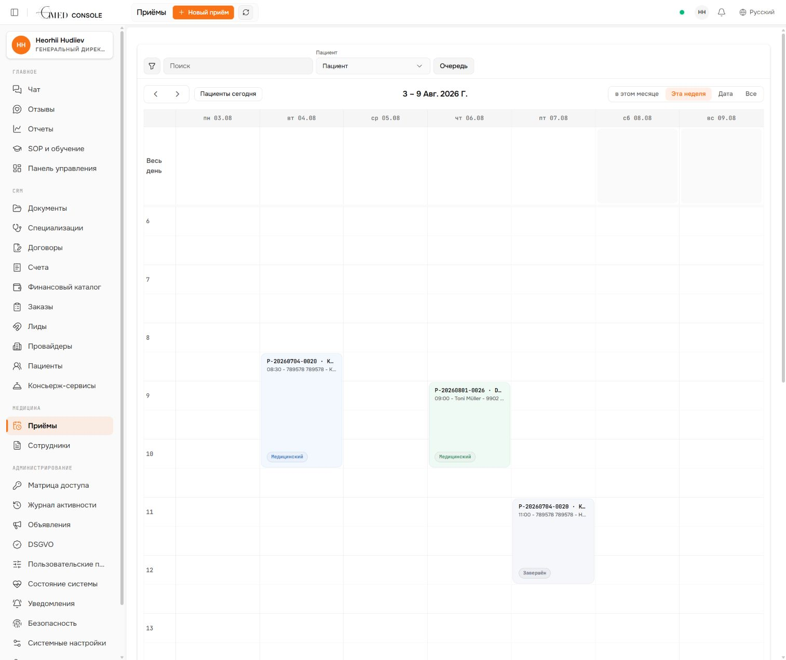
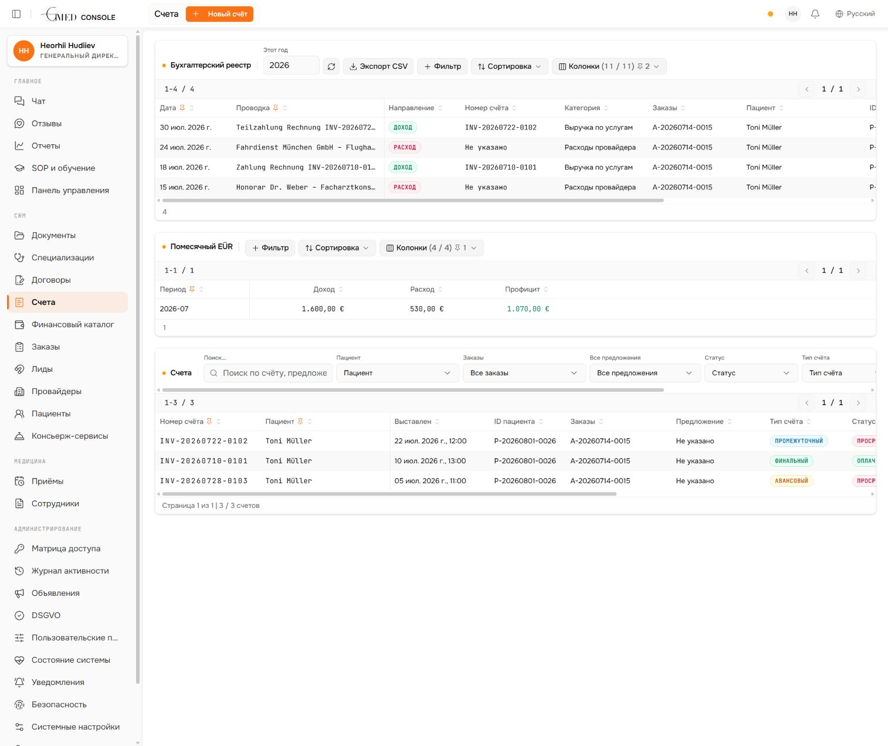
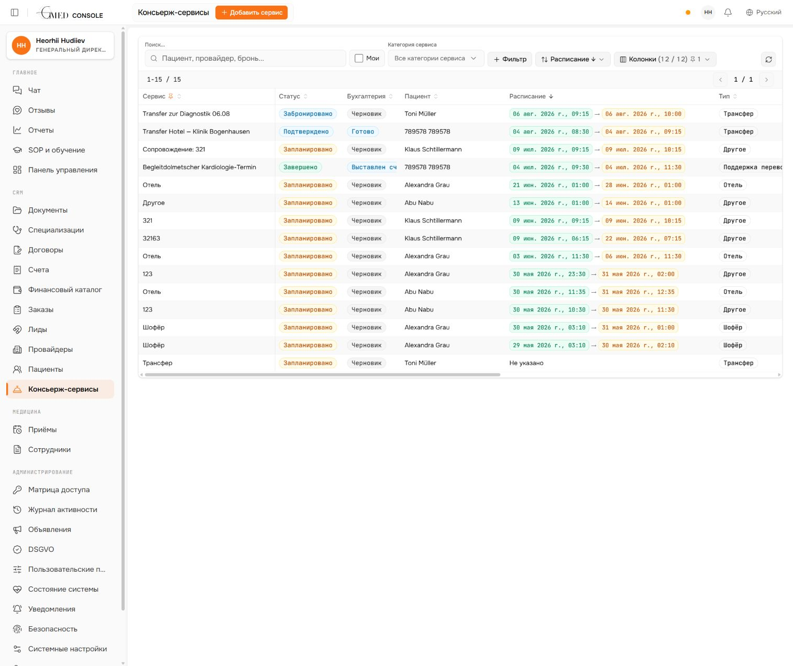
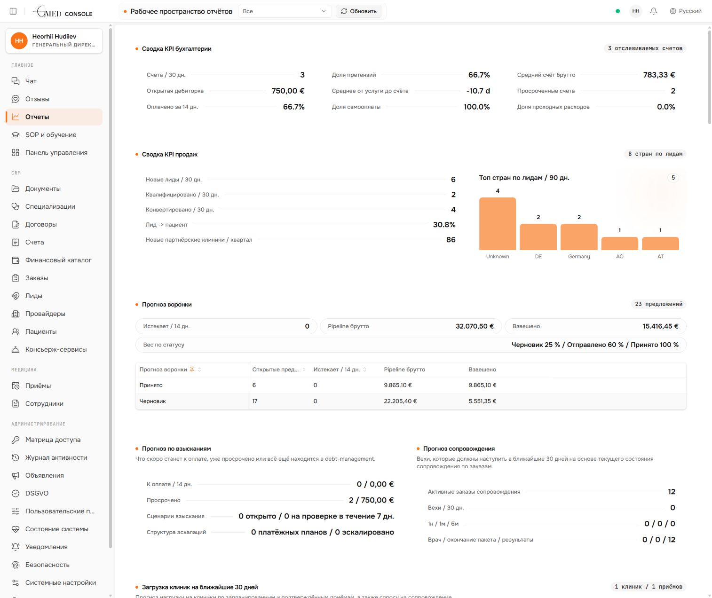

# Аудит рольових кабінетів GMED

Дата: 2026-08-11

## 1. Обсяг аудиту

Перевірено:

- 10 канонічних ролей у домені;
- поточне меню й frontend route guard;
- backend role checks, field-level policy та assignment rules;
- спільний staff dashboard;
- кабінети пацієнта, прийомів, фінансів, concierge-сервісів, звітів і матриці доступу.

Основне рішення: не створювати десять окремих застосунків. Залишити один shell і спільні робочі модулі, але дати кожній ролі свій стартовий кабінет, власні пріоритетні дії та окремий data scope.

Формула доступу має бути єдиною для UI й API:

`роль + призначення до пацієнта/задачі + клас даних + статус публікації + конкретна дія`.

## 2. Докази поточного стану

### Крок 1 — повна клінічна карта CEO

Стан: добре для CEO і призначеного Patient Manager. Ризиковано як універсальний patient screen: Billing, Concierge, Interpreter та IT Admin повинні отримувати окремі скорочені представлення, а не ту саму сторінку з прихованими окремими полями.

### Крок 2 — спільний staff dashboard

Стан: візуально цілісний, але функціонально не рольовий. Один компонент одночасно показує ліди, демографію, клініку, страхування, операційну роботу, провайдерів і вартість pipeline. Для більшості ролей частина блоків нерелевантна або заборонена; API-помилки мовчки перетворюються на порожні графіки.

### Крок 3 — матриця доступу

Стан: сильна основа для field-level access. Критична прогалина: у таблиці немає колонок CEO та IT Admin, бо їхні права зашиті в код. Через це повний доступ IT Admin не видно й не можна безпечно контролювати з продукту.

### Крок 4 — прийоми

Стан: придатний спільний модуль, але потрібні рольові режими. PM керує прийомом, Teamlead розподіляє перекладачів, Interpreter бачить лише власний agenda, Concierge — лише логістичні частини. Не всі мають бачити однакову картку прийому.

### Крок 5 — фінанси

Стан: правильна база для Billing. CEO має повний огляд, CEO Assistant і PM — читання у своєму scope, Billing — CRUD і debt workflow. Interpreter, Concierge, Sales та IT Admin не повинні бачити per-invoice дані.

### Крок 6 — concierge-сервіси

Стан: найближчий до правильного рольового кабінету. Для Concierge фільтр «Мої» має бути активним за замовчуванням; доступ — до поїздки, контактів, бронювання, сервісних документів і статусу передачі в Billing, без клініки та маржинальності.

### Крок 7 — звіти

Стан: хороший спільний контейнер, але секції треба формувати сервером за роллю. Sales бачить лише агреговану воронку й партнерські KPI, Billing — фінанси, PM — власний patient pool, Teamlead — командне навантаження, CEO — все.

## 3. Цільові кабінети

### Ролі першого релізу

У поточному релізі використовуються лише три робочі ролі: `CEO`, `Concierge` і `Billing` (Бухгалтер). Інші описані нижче ролі є майбутньою моделлю й не повинні зараз створювати окремі меню, dashboard presets або ускладнювати реалізацію першого релізу.

| Модуль | CEO | Concierge | Бухгалтер |
| --- | --- | --- | --- |
| Dashboard | повний executive | власна операційна черга | фінансова черга |
| Leads | повний доступ | тільки read-only грід | немає |
| Providers | повний доступ | контакти й координація | фінансові реквізити та витрати |
| Patients | повна карта | призначені, скорочена сервісна карта | payer/billing projection |
| Appointments | повний доступ | логістична частина | немає |
| Employees | повний доступ | read-only довідник | немає |
| Concierge services | повний доступ | робочий CRUD у своєму scope | фінансовий статус/витрати |
| Documents | повний доступ | лише сервісні документи | лише фінансові документи |
| Orders, contracts, invoices | повний доступ | немає фінансових деталей | фінансовий CRUD |
| Finance catalog і reports | повний доступ | немає | повний фінансовий доступ |
| Feedback | повний доступ | немає | немає |
| Administration | повний доступ | немає | немає |

У backend ці ролі мають перевірятися не лише через меню: direct URL, API list/detail, поля й mutations повинні відповідати цій самій матриці.

### CEO

Стартова сторінка:

- executive summary: активні пацієнти, ліди, замовлення, cash/debt, ризики;
- проблеми, які вимагають рішення CEO;
- KPI команд: PM, interpreters, concierge, billing, sales;
- прогноз виручки, загрузки клінік і супроводу.

Меню: абсолютно всі бізнес-модулі, reports, feedback, compliance та administration. CEO бачить усі списки, деталі, поля й дії, має повний drill-down з audit trail. Операційні кнопки доступні, але не повинні домінувати на стартовому екрані.

### CEO Assistant

Стартова сторінка:

- agenda CEO, approvals і прострочені executive tasks;
- read-only summary по пацієнтах, замовленнях, фінансах та VIP-сервісах;
- документи й комунікації, які очікують координації;
- ключові зміни за день.

Меню: dashboard, chat, feedback, reports, SOP, дозволені documents, patients, contracts, invoices і finance catalog у read-only режимі. Не показувати system admin. Для календаря потрібне окреме read-only представлення «Календар CEO», а не повний appointment CRUD.

### Patient Manager

Стартова сторінка:

- «Мої пацієнти» та next actions;
- нові/неповні ліди, readiness gates і конвертація;
- прийоми сьогодні, документи на підтвердження, рекомендації;
- ризики, прострочені задачі, незакриті замовлення;
- KPI лише власного patient pool.

Меню: chat, feedback, reports власного scope, SOP, leads, assigned patients, clinical data, documents, appointments, orders, providers, concierge services, compliance. Повний clinical CRUD тільки для призначених пацієнтів.

### Teamlead Interpreter

Стартова сторінка:

- черга запитів на переклад;
- покриття прийомів і конфлікти розкладу;
- навантаження команди;
- звіти/години на перевірку;
- прострочені переклади й feedback по команді.

Меню: chat, feedback, SOP, team appointments, interpreter staff, released translation documents, assigned patient briefs. Без фінансів, договорів, загальної клінічної карти й provider pricing. Медичний контекст — тільки explicitly released і потрібний для конкретного assignment.

### Interpreter

Стартова сторінка:

- «Моя зміна»: сьогоднішні й наступні призначення;
- документи, які треба прочитати/перекласти;
- кнопки прийняти, відхилити, попросити обговорення;
- submit report, hours і status;
- повідомлення по конкретних призначеннях.

Меню: my agenda, assigned documents, assigned patient brief, chat, SOP. Не показувати глобальні Patients/Documents як загальні реєстри. Жодних фінансів, provider directory, leads чи admin.

### Concierge

Стартова сторінка:

- «Мої сервіси сьогодні»;
- трансфери, готелі, бронювання, водії, нагадування;
- проблемні або непідтверджені сервіси;
- сервісні ліди, які очікують concierge follow-up;
- сервісні документи й комунікація;
- готовність передачі в Billing.

Меню: dashboard, leads, providers, assigned patients, appointments, employees, concierge services, logistics calendar, service documents, chat і SOP.

Leads поки доступні тільки як read-only грід: Concierge бачить рядки сервісної черги та безпечні колонки для координації, але не може відкрити картку ліда, wizard або URL детальної сторінки, редагувати, створювати, видаляти чи експортувати лідів. У гріді залишити лише ім'я/контакт, країну або дати поїздки за потреби, запитані concierge-сервіси, статус комунікації та відповідального Concierge. Не показувати скаргу, діагнози, медичні документи, consent details, quote/invoice details або інші клінічні й фінансові поля.

Providers — каталог потрібних для координації провайдерів і контактів без clinical details та provider pricing. Patients — лише призначені Concierge пацієнти у скороченому представленні: контакти, поїздка, сервіси, логістичні прийоми й сервісні документи.

Appointments — лише призначені або пов'язані з concierge-сервісами прийоми. Показувати дату й час, місце, провайдера та контакти, трансфер, перекладача/супровід і логістичний статус. Дозволити оновлювати тільки логістичні поля; не показувати причину звернення, медичні нотатки, діагнози, результати, вкладені clinical documents або фінансові поля. Не показувати Feedback, Reports, повні рахунки чи маржинальність.

Employees — read-only службовий довідник для координації: ім'я, роль/посада, робочі контакти, мови, доступність або робочий графік. Не дозволяти створення, редагування чи видалення співробітників і не показувати permissions, системні ролі, sessions/MFA, зарплату, договори, домашню адресу, приватні контакти, audit або інші HR/admin дані.

### Billing

Стартова сторінка:

- invoice queue, draft/issued/overdue;
- debt management і dunning;
- orders ready/blocked for billing;
- provider expenses та missing documents;
- VAT/tax warnings і фінансові KPI.

Меню: invoices, contracts/quotes, orders finance view, finance catalog, financial documents, provider/service costs, reports. Patient profile — лише ім'я/ID, insurance, payer, billing contacts і financial timeline. Без клініки, внутрішніх нотаток і travel details.

### Sales

Стартова сторінка:

- lead pipeline, qualification і conversion;
- follow-ups сьогодні;
- lost reasons і funnel velocity;
- partner/provider pipeline;
- aggregate revenue forecast без per-invoice доступу.

Меню: leads, providers/partners, specializations/catalog reference, reports sales section, CRM custom fields, SOP. Не показувати Patients, Documents, internal Chat, Contracts/Invoices або appointment details.

### IT Admin

Стартова сторінка:

- health checks, uptime, worker/queue state;
- failed integrations, OCR status, storage, backups;
- users, roles, sessions, MFA, audit and security alerts;
- release/version, migrations і configuration drift.

Меню обмежене групою Administration: system health, users/roles, access matrix, activity/audit, security, notifications, settings, integrations/OCR workers, backups/migrations і technical SOP. Стартовою сторінкою є технічний dashboard, а не бізнес-dashboard.

Не показувати Feedback, Reports, Chat, Leads, Providers, Patients, Documents, Appointments, Orders, Contracts, Invoices або Services. Жодного постійного доступу до production patient, clinical, finance або document contents. Для підтримки потрібен окремий break-glass режим: причина, обмежений час, explicit approval, watermark і повний audit.

### Patient

Стартова сторінка:

- найближчі дії: підтвердити документ, оплатити, прийняти рекомендацію;
- наступні прийоми й запити;
- опубліковані документи;
- власні invoices/payments;
- concierge services, feedback і privacy requests.

Меню порталу вже сформоване правильно: dashboard, chat, appointments, recommendations, documents, services, invoices, feedback, privacy. Показувати тільки записи зі статусом `patient_visible` або власні portal resources.

## 4. Найважливіші конфлікти current state

### P0 — IT Admin має повний бізнес-доступ

`Role::has_full_access()` повертає true для CEO та IT Admin, а `require_any_role()` автоматично пропускає обидві ролі. `check_access()` також дозволяє IT Admin усі sensitivity classes. Це суперечить продуктовій матриці «test/technical data only» і робить frontend menu hiding недостатнім захистом.

Рішення: повний business bypass залишити тільки CEO. IT Admin перевести на strict technical allow-list; production data — лише через break-glass.

### P0 — Concierge не можна додавати до поточного повного Leads workspace

Поточний Leads workspace містить wizard, медичні дані, consent і фінансові кроки. Просте додавання ролі Concierge до наявного `ROLES_LEADS` відкриє зайві дані й дії.

Рішення: окрема capability `concierge_leads_grid` і серверна проєкція колонок. Дозволити лише list endpoint та грід; detail endpoint, wizard, mutations, export і direct URL мають повертати deny. `Feedback` і `Reports` для Concierge також deny.

### P0 — один dashboard для всіх staff-ролей

Один компонент завжди запитує overview, leads, patients, tasks, demographics, clinical і operations. Заборонені API перетворюються на пусті дані через `.catch(() => null/[])`, тому користувач бачить беззмістовні або хибні блоки замість власної роботи.

Рішення: server-driven dashboard capabilities і окремі role presets. Не завантажувати endpoint, якщо секція ролі не дозволена.

### P0 — dashboard analytics не завжди scoped

Deep analytics дозволяє Billing і Sales отримувати demographic та clinical aggregate endpoints; Patient Manager бачить global aggregate замість власного pool. Навіть агрегати мають бути явно класифіковані й scoped.

Рішення: окремі endpoint contracts: `executive`, `pm-own`, `interpreter-team`, `concierge-own`, `billing`, `sales-aggregate`, `it-ops`.

### P1 — однаковий patient screen для різних задач

Current nav допускає Billing, Concierge, Interpreter та IT Admin до `/patients`. Навіть якщо окремі поля фільтруються, повна структура клінічної карти створює неправильні очікування й ризик майбутнього витоку.

Рішення: role-specific patient projections і вкладки. Назви в nav також мають бути scoped: «Мої пацієнти», «Пацієнти за призначеннями», «Платники», «Контакти по сервісах».

### P1 — приховані й суперечливі правила

Матриця UI не показує CEO та IT Admin. Teamlead у різних місцях одночасно позначений як той, хто може бачити medical data, і як той, кому Medical заборонено. Frontend та backend мають кілька різних джерел правди.

Рішення: одна capability registry з генерацією nav, route guards, endpoint checks, field projections і regression tests.

## 5. Рекомендований порядок впровадження

1. **Security boundary:** повний доступ залишити CEO; забрати full-access bypass у IT Admin, додати strict technical routes і break-glass.
2. **Concierge boundary:** додати `concierge_leads_grid`, scoped Providers/Patients/Services; заборонити lead detail/wizard та Feedback/Reports.
3. **Role dashboard contract:** визначити capability payload і сім staff dashboard presets.
4. **Scoped workspaces:** розділити patient/document/appointment projections для PM, Interpreter, Concierge і Billing.
5. **Action permissions:** окремо визначити `view/create/edit/delete/approve/export/share` для кожного модуля.
6. **Regression:** для кожної ролі перевірити nav, direct URL, list scope, detail scope, field masking і mutation deny.

## 6. Evidence limits

Візуально перевірено поточну CEO-сесію та доступні з неї робочі простори. Окремих активних тестових сесій усіх ролей не було, тому точний вигляд їхнього меню підтверджено кодом route guard і backend policies, а не окремими screenshots. Повна accessibility-відповідність не перевірялась; скріншоти дозволяють оцінити ієрархію й щільність, але не keyboard/focus/screen-reader behavior.
