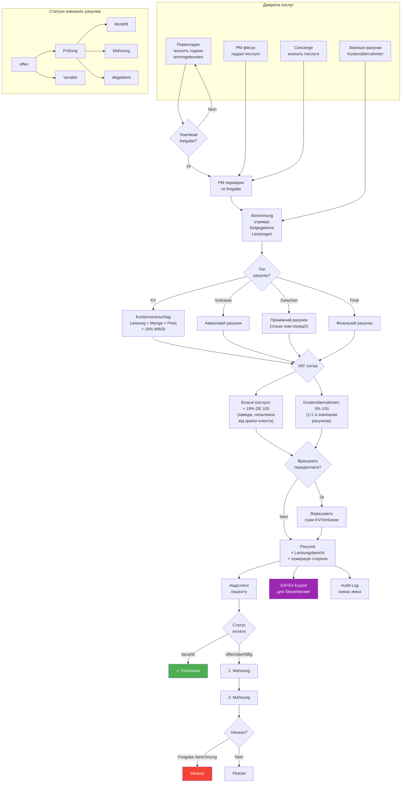
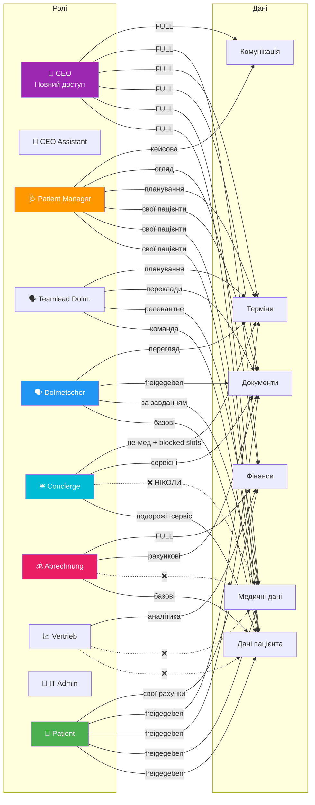
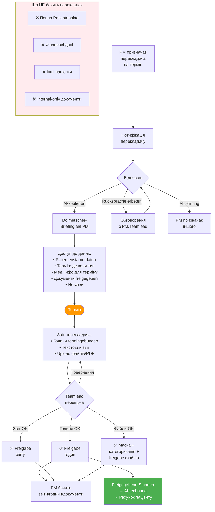
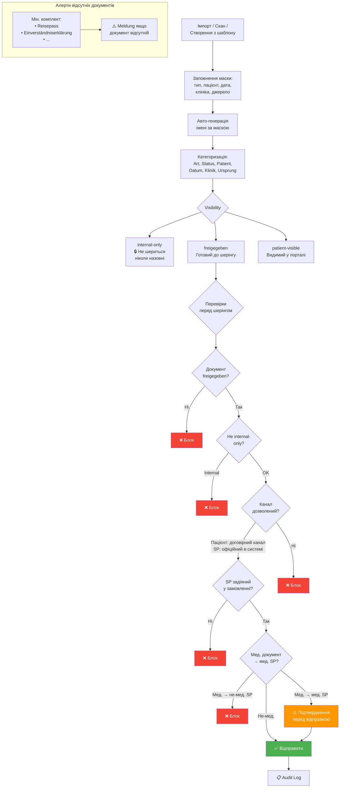

# System Diagrams — Medical Tourism CRM/ERP

---

## 1. Доменна модель (Entity Relationship)

```mermaid
erDiagram
    Lead ||--o| Patient : "конвертується в"
    Patient ||--o{ PatientAssignment : "призначення"
    Patient ||--o{ Case : "має кейси"
    Patient ||--o{ Order : "має замовлення"
    Patient ||--o{ Document : "має документи"
    Patient ||--o{ Appointment : "має терміни"
    Patient ||--o{ Invoice : "має рахунки"
    Patient ||--o{ ConsentRecord : "згоди DSGVO"
    Patient ||--o{ FeedbackForm : "feedback"

    PatientAssignment }o--|| Staff : "призначений до"

    Case ||--o{ AnamnesisMain : "анамнез"
    Case ||--o{ PainRecord : "болі"
    Case ||--o{ Symptom : "симптоми"
    Case ||--o{ Vorerkrankung : "попередні хвороби"
    Case ||--o{ OperationRecord : "операції"
    Case ||--o{ Allergy : "алергії"
    Case ||--o{ Medication : "медикаменти"
    Case ||--o| VegetativeAnamnese : "вегетативний"
    Case ||--o| ImpfStatus : "вакцинація"

    Order ||--|| FrameworkContract : "базується на"
    Order ||--o{ OrderLeistung : "послуги"
    Order ||--o| Quote : "кошторис (KV)"
    Order ||--o{ Invoice : "рахунки"
    Order ||--o{ Appointment : "терміни"
    Order ||--o{ Checklist : "чеклісти"

    Provider ||--o{ ProviderDoctor : "лікарі"
    Provider ||--o{ ServiceCatalog : "каталог послуг"
    Provider ||--o{ CooperationContract : "договір кооперації"
    Provider ||--o{ ProviderTemplate : "шаблони"

    Appointment ||--|| Patient : "пацієнт"
    Appointment ||--|| Provider : "провайдер"
    Appointment }o--o| Staff : "перекладач"
    Appointment ||--|| Order : "замовлення"
    Appointment ||--o{ AppointmentChecklist : "чеклісти"
    Appointment ||--o{ InterpreterReport : "звіти перекл."
    Appointment ||--o{ Reminder : "нагадування"

    Invoice ||--o{ InvoiceLineItem : "позиції"
    Invoice ||--o{ Payment : "оплати"
    Invoice ||--o{ ExternalBelege : "зовнішні квитанції"

    Document ||--o{ ShareGrant : "дозволи шерінгу"
    Document ||--o{ DocumentVersion : "версії"

    Staff ||--o{ Task : "завдання"
    Staff ||--|| Role : "роль"

    AuditEvent }o--|| Staff : "хто"

    Lead {
        uuid id PK
        string name
        string contact_data
        string source
        enum status "new|qualified|converted|archived"
        boolean compliance_signed
    }

    Patient {
        uuid id PK
        string patient_id "авто-генерація"
        string title
        string first_name
        string last_name
        date birth_date
        enum gender
        string nationality
        string languages
        json contacts "адреси телефони emails"
        json insurance "Versichertendaten"
        json related_persons "родичі екстрений контакт"
        json legal_status "DSGVO Schweigepflicht Vertrag"
        text notes
    }

    Case {
        uuid id PK
        string case_id "авто-генерація"
        uuid patient_id FK
        uuid manager_id FK
        enum status "open|in_progress|closed"
        text hauptanfragegrund
        text aktuelle_anamnese
        text zuweiser
    }

    PainRecord {
        uuid id PK
        uuid case_id FK
        text location "Wo"
        text seit_wann
        text ursache
        text qualitaet
        text kontinuitaet
        text entwicklung
        int nrs_aktuell "1-10"
        int nrs_anfang "1-10"
        text dauer_anfang
        text dauer_aktuell
        text ausstrahlung
        text auftreten
    }

    Medication {
        uuid id PK
        uuid case_id FK
        string handelsname
        string wirkstoff
        decimal dosis
        string dosis_einheit
        string einnahmeschema "x-x-x-x"
        enum darreichungsform "Tabl Loesung Spray Pen"
        string einheit
        text anmerkung
        text grund
        date seit "MM.YYYY"
        uuid verordnender_arzt FK
        enum typ "permanent|temporary"
        date expiry_date "для temporary"
    }

    Order {
        uuid id PK
        uuid patient_id FK
        uuid framework_contract_id FK
        enum phase "discovery|intake|execution|closure|followup"
        json leistungen
        text conditions
        boolean signed_patient
        boolean signed_agency
        date signed_at
    }

    Provider {
        uuid id PK
        string name
        text address
        string phones
        string emails
        enum type "medical|non_medical"
    }

    Appointment {
        uuid id PK
        uuid patient_id FK
        uuid provider_id FK
        uuid order_id FK
        uuid interpreter_id FK
        enum type "medical|non_medical|internal"
        date date
        time time
        string location
        string category
        string art
        enum checklist_phase "preparation|execution|followup"
    }

    Invoice {
        uuid id PK
        uuid patient_id FK
        uuid order_id FK
        enum type "rechnung|kv|vorkasse|zwischen|mahnung"
        enum status "draft|sent|paid|overdue|mahnung1|mahnung2|inkasso"
        decimal total
        decimal vat
        date due_date
        int page_count
    }

    Document {
        uuid id PK
        uuid patient_id FK
        string auto_name "маска"
        enum art
        enum status "draft|active|archived"
        enum visibility "internal|freigegeben|patient_visible"
        date created_at
        string klinik
        string ursprung
    }

    Staff {
        uuid id PK
        string name
        enum role
        uuid assigned_by FK
    }

    InterpreterReport {
        uuid id PK
        uuid appointment_id FK
        uuid interpreter_id FK
        decimal hours
        text report
        enum approval_status "pending|approved|rejected"
        uuid approved_by FK
    }
```

---

## 2. Бізнес-процес: Клієнтська подорож

```mermaid
flowchart TD
    START([Kunde/Lead kontaktiert uns]) --> DECIDE{Lead oder Kunde?}

    DECIDE -->|Lead| SALES1[1-е Vertriebsgespräch<br/>Дані, потреби, Compliance]
    DECIDE -->|Kunde| KUNDE_CHECK[Bedarfserfassung<br/>Anamnese-Update<br/>Daten-Update]

    %% LEAD PATH
    SALES1 --> CONTACT[Kontaktdaten<br/>Personalausweis<br/>Compliance-Dokumente]
    CONTACT --> COMPL{Compliance<br/>unterschrieben?}
    COMPL -->|Nein| RUECK1[Rücksprache<br/>Offene Fragen klären]
    RUECK1 --> COMPL
    COMPL -->|Ja| ANAMNESE[Detaillierte Anamnese<br/>Daten & Dokumente<br/>Fall-Evaluation<br/>Leistungsplanung]
    ANAMNESE --> RUECK2[Rücksprache mit Lead<br/>Preiskalkulationen<br/>Leistungspaket<br/>Leistungsvertrag<br/>1. Auftrag]
    RUECK2 --> QUAL{Lead<br/>qualifiziert?}
    QUAL -->|Nein| DELETE1[Datenlöschung]
    QUAL -->|Ja| SEND[LV + Auftrag +<br/>KV zusenden]
    SEND --> SIGNED{LV + Auftrag<br/>unterschrieben?<br/>KV bezahlt?}
    SIGNED -->|Nein| DELETE2[Datenlöschung]
    SIGNED -->|Ja| CONVERT[Lead → Kunde<br/>Konvertierung<br/>PM Zuweisung]

    %% KUNDE PATH
    KUNDE_CHECK --> VALID{Stammdaten<br/>Compliance<br/>Vertrag gültig?}
    VALID -->|Nein| UPDATE[Update Daten] --> VALID
    VALID -->|Ja| DEBT{Schulden?}
    DEBT -->|Ja| SCHULDEN[Schulden-<br/>management]
    DEBT -->|Nein| AUFTRAG[Auftrag erstellen]
    AUFTRAG --> FREIGABE{Freigabe<br/>Abrechnung?}
    FREIGABE -->|Ja| SEND2[Auftrag + KV<br/>zusenden]
    FREIGABE -->|Nein| PAKET{Von Paket-<br/>leistung<br/>abgedeckt?}
    PAKET -->|Ja| PLAN
    PAKET -->|Nein| SEND2
    SEND2 --> SIGNED2{Unterschrieben?<br/>Bezahlt?}
    SIGNED2 -->|Ja| PLAN

    %% PLANNING
    CONVERT --> PLAN[Untersuchungs-/<br/>Behandlungsplan<br/>erstellen]
    PLAN --> KV[Kostenvoranschlag<br/>erstellen]
    KV --> NICHTMED{Nicht-med.<br/>Leistungen<br/>nötig?}
    NICHTMED -->|Ja| ORG_NM[Organisation<br/>nicht-med. Leistungen]
    NICHTMED -->|Nein| TERMINE

    ORG_NM --> TERMINE[Termine<br/>vereinbaren]
    TERMINE --> SEND_PLAN[Plan an Kunde<br/>senden + Rücksprache]
    SEND_PLAN --> KORR{Korrektur<br/>nötig?}
    KORR -->|Ja| PLAN
    KORR -->|Nein| FREIG[Plan freigeben]

    %% PREPARATION
    FREIG --> PREP1[Med. Termine<br/>bestätigen]
    FREIG --> PREP2[Dolmetscher<br/>zuweisen + Briefing]
    FREIG --> PREP3[Nicht-med.<br/>bestätigen]
    PREP1 & PREP2 & PREP3 --> DOCS[Vorbereitungs-<br/>unterlagen senden]

    %% EXECUTION
    DOCS --> ARRIVAL([Kundenankunft])
    ARRIVAL --> EXEC1[Behandlungsplan<br/>durchführen]
    ARRIVAL --> EXEC2[Concierge-Service]
    ARRIVAL --> EXEC3[Dolmetscher-/<br/>Betreuungsleistungen]
    EXEC1 & EXEC2 & EXEC3 --> ABSCHLUSS[Behandlungs-<br/>abschluss vor Ort]

    %% POST-CARE
    ABSCHLUSS --> BEFUNDE[Befunde + Arztbriefe<br/>weiterleiten]
    BEFUNDE --> TRANSLATE[Befunde<br/>übersetzen]
    TRANSLATE --> BILLING[Abrechnung]
    BILLING --> FOLLOWUP[Follow-ups:<br/>1W / 1M / 6M /<br/>1M vor Paketablauf /<br/>gemäß Anordnungen]
    FOLLOWUP --> END([Ende])

    %% STYLES
    style START fill:#4CAF50,color:#fff
    style END fill:#2196F3,color:#fff
    style DELETE1 fill:#f44336,color:#fff
    style DELETE2 fill:#f44336,color:#fff
    style ARRIVAL fill:#FF9800,color:#fff
    style CONVERT fill:#9C27B0,color:#fff
```

---

## 3. Анамнестичний флоу

```mermaid
flowchart TD
    START([Case ID генерація]) --> ID_OK{Case ID<br/>створено?}
    ID_OK -->|Ні| ERSATZ[Ersatzoption]
    ID_OK -->|Ja| MASK[Anamnesemaske<br/>відкрито]

    MASK --> S1[Hauptanfragegrund<br/>Freitext]
    S1 --> C1{Complete?}
    C1 --> S2[Aktuelle Anamnese<br/>Freitext lang]
    S2 --> C2{Complete?}
    C2 --> S3[Zuweiser<br/>Freitext]
    S3 --> C3{Complete?}

    C3 --> PAIN{Schmerzen?}
    PAIN -->|Ja| PAIN_ADD["Add Schmerz (+)<br/>12 полів:<br/>Wo, Seit wann, Ursache,<br/>Qualität, Kontinuität,<br/>Entwicklung, NRS aktuell,<br/>NRS Anfang, Dauer Anfang,<br/>Dauer aktuell, Ausstrahlung,<br/>Auftreten"]
    PAIN_ADD --> PAIN_MORE{Ще біль?}
    PAIN_MORE -->|Ja| PAIN_ADD
    PAIN_MORE -->|Nein| SYMP
    PAIN -->|Nein| SYMP

    SYMP{Інші<br/>симптоми?}
    SYMP -->|Ja| SYMP_ADD["Add Symptom (+)<br/>Beschreibung +<br/>Fachrichtungsauswahl"]
    SYMP_ADD --> FACH{Фахнапрямок<br/>вибрано?}
    FACH -->|Ja| SUBFLOW["Суб-флоу:<br/>Kardiologie / Gastro /<br/>Ortho / Neuro / ..."]
    FACH -->|Nein| SYMP_MORE
    SUBFLOW --> SYMP_MORE{Ще симптоми?}
    SYMP_MORE -->|Ja| SYMP_ADD
    SYMP_MORE -->|Nein| VOR
    SYMP -->|Nein| VOR

    VOR{Vorerkrankungen?}
    VOR -->|Ja| VOR_ADD["Add (+)<br/>Erkrankung kurz +<br/>Datum MM.YYYY +<br/>Notiz"]
    VOR_ADD --> VOR_MORE{Ще?} -->|Ja| VOR_ADD
    VOR_MORE -->|Nein| OP
    VOR -->|Nein| OP

    OP{Операції?}
    OP -->|Ja| OP_ADD["Add (+)<br/>Datum + Grund +<br/>Arzt (Kontakt) + Notiz"]
    OP_ADD --> OP_MORE{Ще?} -->|Ja| OP_ADD
    OP_MORE -->|Nein| ALLERG
    OP -->|Nein| ALLERG

    ALLERG{Алергії?}
    ALLERG -->|Ja| ALLERG_ADD["Add (+)<br/>Allergie kurz +<br/>Reaktion mittel"]
    ALLERG_ADD --> ALLERG_MORE{Ще?} -->|Ja| ALLERG_ADD
    ALLERG_MORE -->|Nein| IMPF
    ALLERG -->|Nein| IMPF

    IMPF{Impfstatus?}
    IMPF -->|Ja| IMPF_TEXT[Freitext mittel]
    IMPF_TEXT --> MED
    IMPF -->|Nein| MED

    MED{Медикаменти?}
    MED -->|Ja| MED_ADD["Add (+) 10 полів:<br/>Handelsname, Wirkstoff,<br/>Dosis+Einheit, Schema,<br/>Darreichungsform, Einheit,<br/>Anmerkung, Grund,<br/>Seit MM.YYYY, Arzt"]
    MED_ADD --> MED_MORE{Ще?} -->|Ja| MED_ADD
    MED_MORE -->|Nein| VEG
    MED -->|Nein| VEG

    VEG[Vegetative Anamnese:<br/>Appetit/Durst,<br/>Größe cm, Gewicht kg,<br/>Gewichtsveränderungen,<br/>Grund]

    VEG --> DONE([Anamnese Complete])

    style START fill:#4CAF50,color:#fff
    style DONE fill:#2196F3,color:#fff
    style SUBFLOW fill:#FF9800,color:#fff
```

---

## 4. Lifecycle замовлення (Auftrag)

```mermaid
stateDiagram-v2
    [*] --> Entdeckung: Новий пацієнт

    state Entdeckung {
        Erstkontakt --> Erstgespräch: Bedarfserfassung
        Erstgespräch --> Stammdaten: Erfassung
        Stammdaten --> Angebot
        Angebot --> Vertragsabschluss
    }

    Entdeckung --> Auftragserteilung: Договір підписано

    state Auftragserteilung {
        AuftragErstellen --> KVErstellen: Abrechnung
        KVErstellen --> Kostenschätzung: Med. послуги
        Kostenschätzung --> Unterzeichnung: Обидві сторони
        Unterzeichnung --> Vorauszahlung: Якщо потрібно
        Vorauszahlung --> Auftragsfreigabe
    }

    Auftragserteilung --> Durchführung: Auftrag freigegeben

    state Durchführung {
        state "3a Einreise" as EINREISE
        state "3b Aufenthalt" as AUFENTHALT
        state "3c Programm" as PROGRAMM

        EINREISE --> AUFENTHALT
        AUFENTHALT --> PROGRAMM

        state AUFENTHALT {
            Anamnese2 --> Datensammlung
            Datensammlung --> Terminplanung
            Terminplanung --> DolmetscherZuweisung
            DolmetscherZuweisung --> ConciergeOrg
            ConciergeOrg --> ProgrammErstellen
            ProgrammErstellen --> KundeRücksprache
        }
    }

    Durchführung --> Abschluss: Programm beendet

    state Abschluss {
        LeistungenPrüfen --> FreigabeAbrechnung
        FreigabeAbrechnung --> RechnungErstellen
        RechnungErstellen --> BefundeWeiterleiten
        BefundeWeiterleiten --> Übersetzen
    }

    Abschluss --> FollowUp

    state FollowUp {
        state "1 Woche" as W1
        state "1 Monat" as M1
        state "6 Monate" as M6
        state "1M vor Paketablauf" as PAKET
        state "Gemäß Anordnungen" as ARZT

        W1 --> M1
        M1 --> M6
        M6 --> PAKET
        ARZT --> [*]
        PAKET --> [*]
    }
```

---

## 5. Білінг-флоу

---

## 6. RBAC — хто що бачить

---

## 7. Модулі системи (Architecture)

```mermaid
flowchart TD
    subgraph UI ["Frontend Layer"]
        BACK[Internal Backoffice<br/>Web App]
        MOBILE[Mobile App<br/>Dolmetscher]
        PORTAL[Patient Portal]
        DASH[CEO Dashboard]
    end

    subgraph GW ["API Gateway"]
        AUTH[Auth + MFA]
        RBAC[RBAC Engine]
        RATE[Rate Limiting]
        AUDIT_GW[Audit Interceptor]
    end

    subgraph CORE ["Application Core — Modular Monolith"]
        IAM[IAM / RBAC]
        CRM[CRM / Lead Intake]
        PREG[Patient Registry]
        MCASE[Medical Case<br/>& Anamnesis]
        ORD[Orders &<br/>Contracts]
        PROV[Provider<br/>Registry]
        APT[Appointment<br/>Orchestration]
        DOC[Documents<br/>& Sharing]
        COMM2[Communication<br/>& Tasks]
        BILL[Billing &<br/>Payments]
        REP[Reporting<br/>& KPI]
        CONSENT[Consent / Audit<br/>/ Compliance]
        TPL[Template<br/>Engine]
        ESIGN[eSignature<br/>Service]
        SOP[Learning /<br/>SOP Module]
        INTERP[Interpreter<br/>Management]
        CONC2[Concierge<br/>Management]
    end

    subgraph INFRA ["Data & Infrastructure"]
        PG[(PostgreSQL<br/>AES-256)]
        S3[(Object Storage<br/>docs scans PDFs)]
        SEARCH[(Search Index)]
        QUEUE[Queue / Jobs<br/>PDF OCR notify<br/>reminders DATEV]
        AUDIT_STORE[(Audit Store<br/>immutable)]
        CACHE[(Cache)]
        BACKUP[(Backup<br/>3-2-1)]
    end

    subgraph EXT ["External Integrations"]
        EMAIL[Email / SMTP]
        ESIGN_EXT[eSign Provider]
        PAY[Payment Provider]
        CAL[Calendar / ICS]
        OCR_EXT[OCR / Translation]
        DATEV_EXT[DATEV Export]
        AI_GW[AI Gateway<br/>anonymized only]
    end

    UI --> GW --> CORE
    CORE --> INFRA
    CORE --> EXT

    style PG fill:#336791,color:#fff
    style S3 fill:#FF9900,color:#fff
    style AUDIT_STORE fill:#f44336,color:#fff
    style AI_GW fill:#9C27B0,color:#fff
```

---

## 8. Перекладач: повний workflow

---

## 9. Документ: lifecycle та sharing

---

## 10. Follow-up та Checklist по термінах

```mermaid
flowchart LR
    subgraph BEFORE ["Vorbereitung"]
        B1[Документи готові?]
        B2[Переклад Vorbefunde?]
        B3[Передоплата статус?]
        B4[Kostenübernahme?]
        B5[Перекладач призначений?]
        B6[Питання для уточнення?]
        B7[Мед. дані → SP + Dolm.]
        B8["⚠️ Meldung якщо<br/>не все готово"]
    end

    subgraph DURING ["Durchführung"]
        D1[Звіт перекладача]
        D2[Статус оплати]
    end

    subgraph AFTER ["Follow-up"]
        A1[Наступні візити?]
        A2[Контрольні обстеження?]
        A3[Arztbrief отримано?]
        A4[Рахунки / квитанції?]
        A5[Переклад Arztbrief?]
        A6[Пересилка пацієнту]
    end

    BEFORE --> DURING --> AFTER

    subgraph FOLLOWUP_SCHEDULE ["Follow-up розклад"]
        direction TB
        F1["📅 1 тиждень"]
        F2["📅 1 місяць"]
        F3["📅 6 місяців"]
        F4["📅 Згідно лікарських<br/>призначень"]
        F5["📅 1 місяць до<br/>кінця пакету"]
    end
```

